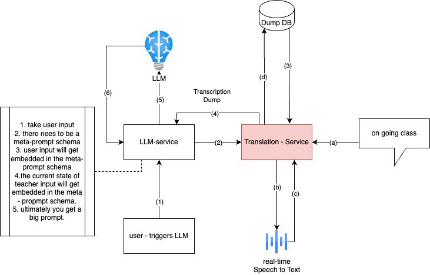

# Real-Time Lecture Co-Pilot

## Overview
This flow diagram depicts a process involving user interaction, language processing, and translation services. Below is a breakdown of the main components and their interactions:

## Components

### 1. User Interaction
- **User - triggers LLM**: Represents the starting point where user interaction initiates the process.
  - **Action**: User triggers an action related to Language Learning Model (LLM).

### 2. Language Processing
- **LLM-service**: A service related to the Language Learning Model.
- **LLM**: The Language Learning Model itself.
  - **Action**: Interaction between LLM-service and LLM.

### 3. Translation Services
- **Translation - Service**: A service for translation functionalities.
- **Dump DB**: Process of dumping data into a database associated with the Translation Service.
  - **Action**: Data dumping process.

### 4. Real-time Speech to Text
- **Real-time Speech to Text**: A component for converting speech to text in real-time.

### 5. Ongoing Class
- **On-going Class**: Represents a class or ongoing session associated with the process.

### 6. Meta-prompt Schema
- **1. take user input**: Step involving taking user input.
- **Meta-prompt Schema**: Schema or structure for handling prompts, possibly related to user input.

## Process Flow
The process begins with user interaction triggering actions related to language processing and translation. The Language Learning Model (LLM) and Translation Service play key roles in processing and translating data. Additionally, real-time speech-to-text conversion and ongoing class sessions are incorporated into the process. The meta-prompt schema outlines steps for handling user input and prompts.

## Flow Diagram

